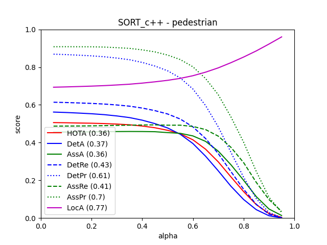

# Introduction
 SORT-in-cpp is a MOT algorithm in cpp ported from [SORT](https://github.com/abewley/sort). It is much faster than the original one and is same with the original in all metrics.
<div  align="center">

</div>

# Dependencies
- opencv  
- eigen  
- glog  

Only opencv needs to be installed manually. Eigen and glog are in thirdparty directory and doesn't need to be installed.


# Dataset:
- download [MOT15](https://motchallenge.net/data/MOT15.zip) data and unzip MOT15.zip to somewhere, e.g. path/to/MOT15.

# Build for linux:
```
git clone https://github.com/wangziren1/SORT-in-cpp.git
cd SORT-in-cpp
ln -s path/to/MOT15 mot_benchmark
mkdir build && cd build
cmake ..
make
```

# Run:
```
cd build
GLOG_logtostderr=1 ./MOT15/MOT15
```
The tracking results will be in output directory.

# Evaluate:
The tracking is evaluated by [TrackEval](https://github.com/JonathonLuiten/TrackEval).
1. install
```
git clone https://github.com/JonathonLuiten/TrackEval.git
cd TrackEval
pip3 -r install minimum_requirments.txt
```
2. prepare data  

download [data](https://omnomnom.vision.rwth-aachen.de/data/TrackEval/data.zip) and unzip it to TrackEval directory.
```
cd TrackEval/data/trackers/mot_challenge/MOT15-train
mkdir SORT_c++ && cd SORT_c++
cp -r path/to/output .
mv output data
```
1. evaluate
```
python3 scripts/run_mot_challenge.py --BENCHMARK MOT15 --SPLIT_TO_EVAL train --TRACKERS_TO_EVAL SORT_c++ --METRICS HOTA CLEAR Identity VACE --USE_PARALLEL False --NUM_PARALLEL_CORES 1
```

# Performance
1. The all metrics of SORT_c++ are same as that of the origin one.
<div  align="center">

</div>
2. The running time of SORT_c++ is really fast. On Intel® Core™ i5-1135G7, the tracking takes 0.067 seconds for 5500 frames, while the origin one takes 3.531 seconds. If the program closes the opencv show window, the tracking takes 0.03 seconds, which is 117 times faster than the oringin one.


